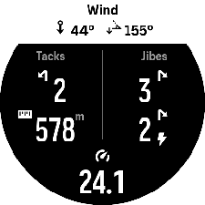

# SuuntoPlus apps - Jibe Counter

Count the number of jibes and tacks during your sailing activity.

## How to use the app
To count the number of tacks and jibes correctly, the app must know the wind direction. To set the wind direction, point the watch straight into the wind and press the upper right button. This can be repeated if the wind shifts dramatically during the activity.

The app shows the following information: 

| Field | Action | 
| ------  | ------ |
| Header left | True wind direction |
| Header right | True wind angle. (The angle between the True wind and your sailing direction) |
| Upper left | Number of tacks performed |
| Lower left | Distance of the current leg |
| Upper right | Number of non-planing jibes performed |
| Lower right | Number of planing jibes performed |
| Bottom | Current speed |

## Controls
| Button | Action | 
| ------  | ------ |
| UP | Sets the compass heading as wind direction |

# Manifest

## Input
| Name  | Description |
| --- | ------------| 
| Distance | The distance of the activity | 
| Heading | The direction of sailing | 
| compassHeading | The compass direction you're pointing the watch to | 
| Speed  | The speed you're sailing |

## Output
| Name | Description |
| --- | ------------| 
| Tacks | Number of tacks | 
| Jibes | Number of non-planing jibes | 
| PlaningJibes | Number of planing jibes | 
| TWA | True Wind Angle | 
| WindDirection | True Wind direction | 
| legDistance | Distance of the current leg | 

## Settings
| Name | Type | Description |
| --- | -----| ------------| 
| nauticalSpeed | boolean | Switch to show speeds in knots instead of km/h or mph | 
| nauticalDistance  | boolean | Switch to show distance in nautical miles instead of kilometers/miles |