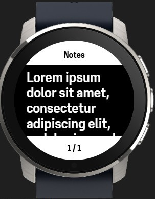
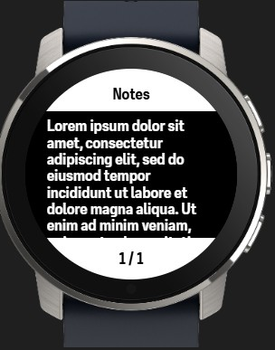
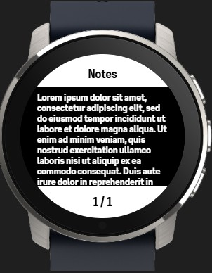
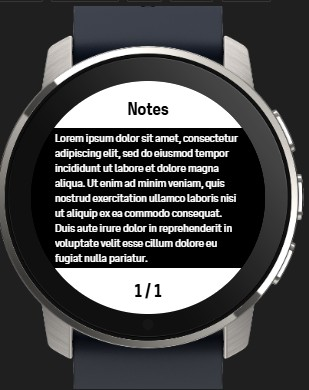

# SuuntoPlus apps -  Notes

Create up to 10 personal notes which can be read during your activity.

## Controls
You can select a different note by pressing the ```UP``` or ```DOWN``` button.


## Font sizes
> [!IMPORTANT]
> Be aware that you can not scroll through the text of a note. Depending on the font size, more or fewer characters can be shown on the screen. 
In the configuration of the SuuntoPlus app, you can define a font size. As shown below, chosing a larger font size gives you less characters than a smaller font size


| Size | Large     | Medium | Small | X-Small | 
| :--- | :---------: | :------: | :-----: | :-------: |
| __Template__ | t-l.html   | t-m.html  | t-s.html | t-xs.html | 
| __Example__ |  |   |  |  |