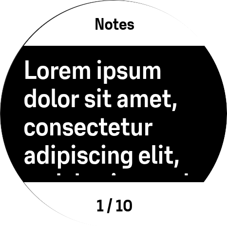
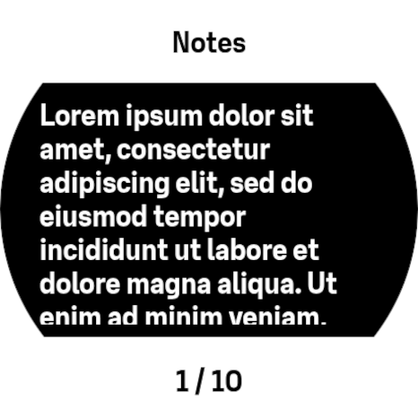
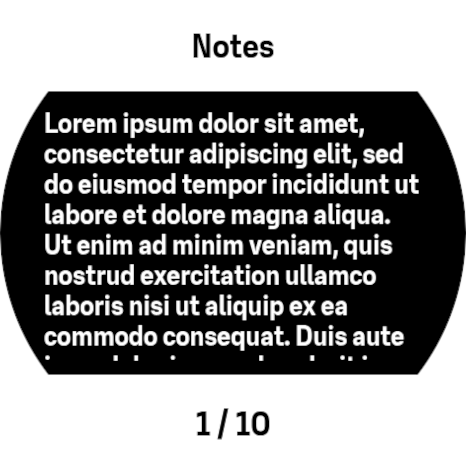

# SuuntoPlus apps -  Notes


Create up to 10 personal notes which can be read during your activity.

## How to use the app
After you install the app from the SuuntoPlus store, go to the settings in the app. There you can add text to each of the 10 predefined notes. In the settings, you can also select the preferred font sizes.

When you start an activity and select "Notes" as a SuuntoPlus app, your notes will appear on the watch and you can navigate between them using the buttons.

## Controls

| Button | Action | 
| ------  | ------ |
| UP | Select previous note | 
| UP-HOLD | Zoom in | 
| DOWN | Select next note | 
| DOWN-HOLD | Zoom out |

## Font sizes (Zoom)
> [!IMPORTANT]
> Be aware that you can not scroll through the text of a note. Depending on the font size, more or fewer characters can be shown on the screen. 

In the configuration of the SuuntoPlus app, you can define a default font size. As shown below, chosing a larger font size gives you less characters than a smaller font size.
When the SuuntoPlus app is active, you can change the font size by holding the ```UP``` or ```DOWN``` button. 


| Size | Large     | Medium | Small | 
| :--- | :---------: | :------: | :-----: |
|   |  |   |  |

# Manifest

## Input
None

## Output
None

## Settings
| Name | Type | Description |
| --- | -----| ------------| 
| Text size | enum | Option for selecting text size of the notes| 
| Note 1  | string | Text for note |
| Note 2  | string | Text for note |
| Note 3  | string | Text for note |
| Note 4  | string | Text for note |
| Note 5  | string | Text for note |
| Note 6  | string | Text for note |
| Note 7  | string | Text for note |
| Note 8  | string | Text for note |
| Note 9  | string | Text for note |
| Note 10  | string | Text for note |
