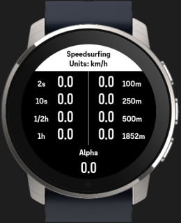
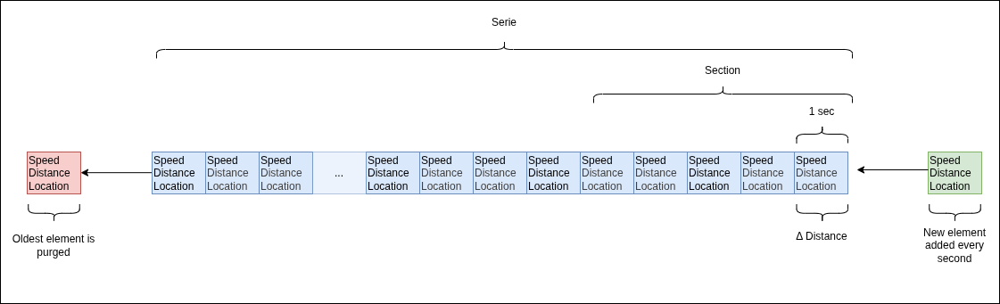

# SuuntoPlus apps -  Speedsurfing
Shows your speeds in the GP3S categories



## How to use the app
> [!IMPORTANT]
> This app is for personal use only. \
> Suunto watches are not on the official [list of approved GNSS devices](https://www.gps-speedsurfing.com/info/gpsequipment/general-information)

The app caculates your maximum speeds for all the [GPS-Speedsurfing (GP3S)](gps-speedsurfing.com) speed categories.
According to their [rules](https://www.gps-speedsurfing.com/info/basicrules) a session consists of:

| Category | Description | 
| -------- | ----------- | 
| **Max Software (2 sec)** | Software calculated highest speed |
| **10 sec run** | Software calculated average speed over 10 seconds (the AVG for is calculated over the 5x 10 sec runs) |
| **1800s (1/2 hour)** | Software calculated average speed over 1800 seconds |
| **3600s (1 hour)** | Software calculated average speed over 3600 seconds |
| **100m** | Software calculated average speed over ‘one’ run of minimal 100 meters |
| **250m** | Software calculated average speed over ‘one’ run of minimal 250 meters |
| **500m** | Software calculated average speed over ‘one’ run of minimal 500 meters |
| **1852m** | Software calculated average speed over ‘one’ run of minimal 1852 meters (Nautical Mile), turn allowed* |
| **Alpha racing** | Software calculated speed over ‘one’ run of 500 meters with a gybe and a proximity at the startpoint of 50 meters. |


## Controls
None

# Calculation algorithm
The app calculates the max speeds for all categories by using a rolling array. The array contains as much elements as needed for the largest category. For speed and memory reasons, the oldest entries are purged when they are no longer necessary for the calculations.

 

Every second an element is added to the array containing three objects:
- ```Speed```: Current speed 
- ```Distance```: The distance traveled in 1 sec
- ```Location```: Geocoordinates at that point

The total array is called the ```Serie```\
The subset of elements necessary for the calculation of the category is called the ```Section```

The calculation of each category is then grouped into two major categories:

### Time categories
The time categories are calculated by getting the average speed of the ```Section```.\

E.g. The section for the 2s category contains 2 elements, the section for the 10s category contains 10 elements etc..   

### Distance categories
Distance categories are handled a little bit different. The app loops through the array from the last element to the first. Adding the individual distances until the sum reaches one of the distance categories. It then determines the average speed of the elements in the ```Section```.

E.g. For the 100m category it adds all the distances from the last element to the first. Element by element until the sum of the distance is greater than 100m. At that point the average speed is caclculated over the selected amount of elements.

**Alpha racing**\
To determine the 500m alpha race category speed, additional calculations are performed on the 500m distance category. The normal 500m category is calculated as described above. The alpha race category adds 2 more tests before it qualifies as an alpha race category:

1. The bearing between the first two elements in the ```Section``` are compared to the bearing between the last two elements. If the difference is more than 120 degrees it is assumed the surfer is moving in the opposite direction. Hence a gybe has been performed.

2. The second test calculates the distance between the first en the last element in the ```Section```. If that distance is less than 50m, the ```Section```.

If both conditions are met, the ```Section``` is considered a valid alpha race over 500m. And the average speed is calculated.

# Manifest

## Input
| Name | Description | Description |
| --- | -----| ------------| 
| Speed | Current speed | 
| Distance  | Total activity distance | 
| Location  | GPS coordinates | 

## Output
| Name | Type | Description |
| --- | -----| ------------| 
| t2 | Time category 2 sec | 
| t10  | Time category 10 sec |
| t1800  | Time category 1800 sec (1/2h)|
| t3600  | Time category 3600 sec (1h)|
| d100  | Distance category 100m |
| d250  | Distance category 250m |
| d500 | Distance category 500m |
| d1852  | Distance category 1852m |
| alpha | Distance category 500m alpha racing |

## Settings
None