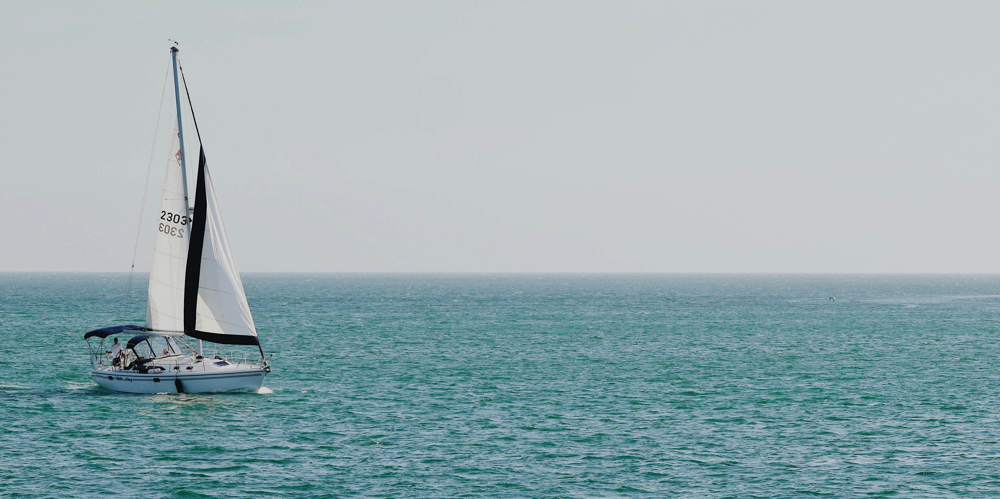

# SuuntoPlus apps - VMG/VMC


Get your VMG and VMC with your sailing activities.

**VMG** (Velocity Made Good) — the speed a boat makes directly toward (upwind) or away from (downwind) the wind source.

**VMC** (Velocity Made on Course) — the speed at which you are actually progressing toward a specific waypoint or mark. It is the component of your SOG (Speed Over Ground) that points directly toward your destination.

## How to use the app

### VMG
Point the watch straight into the wind and hold down the upper right button. The current heading will be used as the wind direction and the VMG is calculated automatically.

### VMC 
Select an existing Point Of Interest (POI) and the app shows you the bearing and VMC from your current posittion to the POI. The title bar will be green if VMC is positive (closing in on the target) and red if VMC is negative (sailing away from the target).

A POI can be created in a couple of ways:

Before the start of your activity:
- Create a POI in Suunto App and sync it with the watch

During your activity:
- Go to the ```navigation screen -> Your location``` on the watch. Save your location as POI
- Go to the ```navigation screen -> Bearing navigation``` on the watch. Shoot a bearing and set a distance
- Go to the ```navigation screen``` and select the desired location on the map. Press the ```DOWN``` button and select ```Save as POI```


## Controls
Unit selection can be done in the SuuntoPlus app settings:
| Setting  | Description |
| --- | ------------| 
| nauticalSpeed | Switch to show speeds in knots instead of km/h or mph | 
| nauticalDistance  | Switch to show distance in nautical miles instead of kilometers/miles |

| Button | Action | 
| ------  | ------ |
| UP | Sets the compass heading as wind direction |
| DOWN | Switch mode between VMG and VMC |

# Manifest

## Input
| Name  | Description |
| --- | ------------| 
| Distance | The distance to the target | 
| Bearing  | The bearing to the target or the wind |
| Heading | The direction of sailing | 
| compassHeading | The compass direction you're pointing the watch to | 
| Speed  | The speed you're sailing |

## Output
| Name | Description |
| --- | ------------| 
| VMC | The speed towards the target | 
| VMG | The speed towards the wind | 
| Bearing | The bearing to the target |

## Settings
| Name | Type | Description |
| --- | -----| ------------| 
| nauticalSpeed | boolean | Switch to show speeds in knots instead of km/h or mph | 
| nauticalDistance  | boolean | Switch to show distance in nautical miles instead of kilometers/miles |